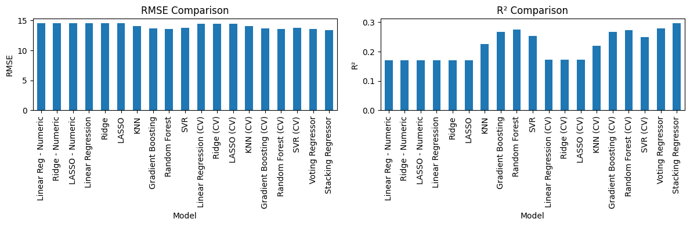
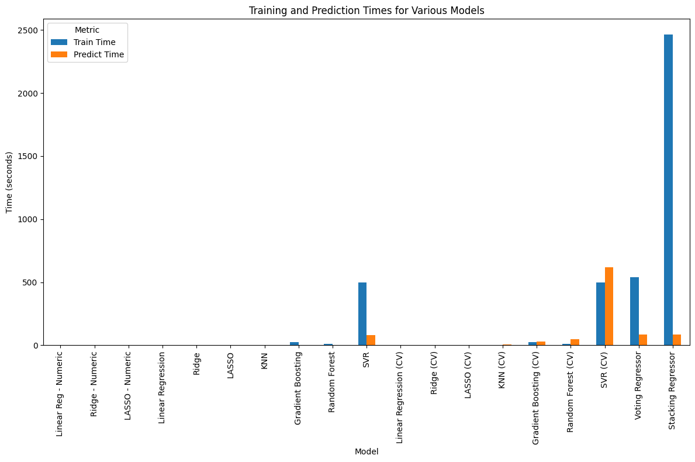

# Spotify Models

This repo contains the notebook that creates models for the [spotify 1M track info](./data/spotify_1M.csv.zip) based of [Kaggle](https://www.kaggle.com/datasets/amitanshjoshi/spotify-1million-tracks)
This is a continuation of the earlier [Spotify data analysis and EDA](https://github.com/dutta-sh/spotify-analysis)

We continue where we left off, by doing a quick recap of the EDA and fixing some assumptions we made earlier.

The notebook is present in this [github repo](./Capstone_Final.ipynb) as well as on [Google Colab](https://colab.research.google.com/github/dutta-sh/spotify-models/blob/main/Capstone_Final.ipynb).

## Problem Statement

The goal here is to compare different ML models by training and testing them on the spotify data and determine which can be a better fit for predicting future outcomes.
- Since we are predicting the popularity of a track, it is going to be a regression problem
- Various supervised learning algorithms will be used to evaluate the right choice of model
- The choice of model depends on the model that has the right balance of RMSE, R2, learning and predicting time

## Technical Description

- set up clean data based on the EDA from the [earlier analysis](https://github.com/dutta-sh/spotify-analysis/blob/main/Capstone_EDA.ipynb)
- use the data to train the baseline model
- use the same data to train various models and compare how they perform
- look at coefficients and features that drive the decision 
- come to a quantifiable solution

## Steps

### Revisit the EDA and determine data set

- for building the code and due to CPU/GPU constraints splitting the 1M rows is necessary
  - split the data into 1K, 10K, 40K, and 100K rows and build the initial codebase
  - apply the EDA from earlier and convert `year` to `age`
  - doing some research I realized that `key, mode, time_signature and genre` are the categorical features that can be used for the model analysis
    - earlier I had picked only `genre`. Lets include the other categorical features
  
    | Feature          | Count |
    |------------------|-------|
    | genre            | 82    |
    | key              | 12    |
    | mode             | 2     |
    | time_signature   | 5     |
        
    - genre has 82 variations, OHE is going to create a lot of features
    - adding this might be too costly on processing without much gain in terms of RMSE
    - 1K data set works fine with genre and all the models below.
    - however 40K rows takes forever to complete. Lets drop `genre` and try

  - finally the dataset to be used has:
    - 100K rows `(100000, 17)`
    - `year` replaced by `age`
    - `track_id` and `Unnamed: 0` columns dropped
    - all numeric and categorical columns except `genre`
    - `popularity` as the target column

### Define models

#### Goal:

- Create baseline models:
  - Use numerical features only
  - Apply on Linear Regression, Ridge and Lasso
- Create advanced models:
  - Use numerical + categorical features
  - Apply on Linear Regression, Ridge, Lasso and KNN
  - Then apply on Gradient Boosting, Random Forest and SVR
- Cross validation models:
  - Apply on Linear Regression, Ridge, Lasso and KNN
  - Then apply on Gradient Boosting, Random Forest and SVR
- Ensemble techniques
  - Voting Regressor
  - Stacking Regressor

#### Steps:

- define data structure and methods to be used during evaluation 
  - this was an iterative process and the notebook has the final state
  - helps organize the code and make it readable while reducing the overall LOC
  - methods/data structures that:
    - holds results of models
    - prepare data and preprocessor
    - fit and predict the model and add the score to results
    - cross validate model and add score to results
    - interpret and plot top N coeffs/features
    - print results sorted by RMSE
- split and prepare data for Numerical columns only
- Create baseline models
- split and prepare data for Numerical and categorical columns
- Create advanced models
- Cross validation models
- Ensemble techniques

### Interpretation

- Training and evaluating on 100K rows of data at 80-20 split

| Model                   | Family     | RMSE      | R²       | Train Time (s) | Predict Time (s) |
|-------------------------|------------|-----------|----------|----------------|------------------|
| Stacking Regressor      | Ensemble   | 13.410493 | 0.297037 | 2464.287442    | 84.232249        |
| Voting Regressor        | Ensemble   | 13.573936 | 0.279798 | 538.196305     | 84.236169        |
| Random Forest (CV)      | Tree       | 13.581417 | 0.273287 | 9.770496       | 50.608546        |
| Random Forest           | Tree       | 13.624984 | 0.274370 | 9.290165       | 0.093697         |
| Gradient Boosting (CV)  | Tree       | 13.644616 | 0.266524 | 25.636972      | 27.972285        |
| Gradient Boosting       | Tree       | 13.692506 | 0.267161 | 25.629110      | 0.038916         |
| SVR (CV)                | Kernel     | 13.795548 | 0.250204 | 499.253639     | 619.248143       |
| SVR                     | Kernel     | 13.826658 | 0.252730 | 498.897594     | 81.171563        |
| KNN (CV)                | Kernel     | 14.065284 | 0.220594 | 0.022798       | 7.584787         |
| KNN                     | Kernel     | 14.077263 | 0.225397 | 0.023566       | 0.671820         |
| Ridge (CV)              | Linear     | 14.497087 | 0.172006 | 0.032586       | 0.912957         |
| Linear Regression (CV)  | Linear     | 14.497088 | 0.172006 | 0.052589       | 1.139734         |
| LASSO (CV)              | Linear     | 14.497517 | 0.171958 | 0.059295       | 0.973224         |
| LASSO                   | Linear     | 14.562231 | 0.171106 | 0.164292       | 0.010588         |
| Ridge                   | Linear     | 14.562623 | 0.171062 | 0.036613       | 0.010011         |
| Linear Regression       | Linear     | 14.562633 | 0.171061 | 0.055338       | 0.010719         |
| Linear Reg - Numeric    | Linear     | 14.573211 | 0.169856 | 0.018499       | 0.003256         |
| Ridge - Numeric         | Linear     | 14.573211 | 0.169856 | 0.012137       | 0.003456         |
| LASSO - Numeric         | Linear     | 14.573241 | 0.169853 | 0.047803       | 0.003238         |

  <table>
    <tr>
        <td></td>
    </tr>
    <tr>
        <td></td>
    </tr>
  </table>

- The Stacking and Voting Regressor outperforms every individual model, confirming that ensemble averaging reduced both bias and variance in this task.
  - Averages predictions from:
      - Tree-based models (low bias, nonlinear)
      - Kernel models (smooth generalization)
      - Linear models (stable baseline)
  - Reduces:
    - Overfitting of trees
    - Underfitting of linear models
  - Captures complementary error patterns

- Tree-Based (Strongest Individual Models)

    | Model                  | RMSE  | R²    |
    |------------------------|-------|-------|
    | Random Forest (CV)     | 13.58 | 0.273 |
    | Random Forest          | 13.62 | 0.274 |
    | Gradient Boosting (CV) | 13.64 | 0.267 |
    | Gradient Boosting      | 13.69 | 0.267 |

  - These models capture nonlinear interactions between audio features and popularity
  - CV and non-CV results are very close, indicating stable generalization
  - Trees handle:
    - Nonlinear tempo–energy effects
    - Threshold effects (e.g., loudness, danceability)
  - Tree-based models are the strongest single learners in this dataset.
  
- Kernel & Distance-Based Models (Mid-Tier)

  | Model    | RMSE  | R²    |
  |----------|-------|-------|
  | SVR (CV) | 13.80 | 0.250 |
  | SVR      | 13.83 | 0.253 |
  | KNN (CV) | 14.07 | 0.221 |
  | KNN      | 14.08 | 0.225 |

  - SVR captures smooth nonlinear trends but struggles at scale
  - KNN suffers from:
    - High dimensionality (OHE + audio features)
    - CV slightly lowers R² → mild overfitting in non-CV runs
  - These models help the ensemble but are not optimal alone.

- Linear Models (Weakest)

  | Model                       | RMSE   | R²     |
  |-----------------------------|--------|--------|
  | Linear / Ridge / LASSO (CV) | ~14.50 | ~0.172 |
  | Linear / Ridge / LASSO      | ~14.56 | ~0.171 |
  | Numeric-only Linear         | ~14.57 | ~0.170 |

    - Popularity is not a linear function of audio features
    - LASSO provides sparsity but not better prediction 
    - Numeric-only models confirm that categorical features matter, but linearity limits benefit 
    - Linear models are good as baselines, not competitive predictors.

### Takeaway

- Ensemble methods give ~8% RMSE improvement over linear baselines
- Upper bound appears near R² ≈ 0.30 using audio + basic metadata only
- Stacking takes ~50,000× longer than linear regression
- Gains only ~1.15 popularity points RMSE
- Downsides of the models

  | Model       | Reason                     |
  |-------------|----------------------------|
  | Stacking    | Extreme train cost         |
  | Voting      | High inference cost        |
  | SVR         | Infeasible prediction time |
  | CV versions | Minimal gain               |

### Summary

Tree-based and ensemble models substantially outperform linear and distance-based approaches when predicting Spotify track popularity from audio and categorical features. 

  

- From 17% of variance explanation by linear regression we moved up to 30% with stacking regressor
    - The cost to train and infer went up exponentially
    - even then while musical characteristics contribute to popularity, most variation is driven by external, non-audio factors
  
- For all practical purposes, `Random Forest (no CV)` is the best approach:
    - RMSE: 13.62
    - R2: 0.274
    - Train: 9 s
    - Predict: 0.09 s
    - Best accuracy-to-cost ratio
    - Random Forest `no CV vs CV` are pretty close, but prediction times for the `no CV` version is way better
